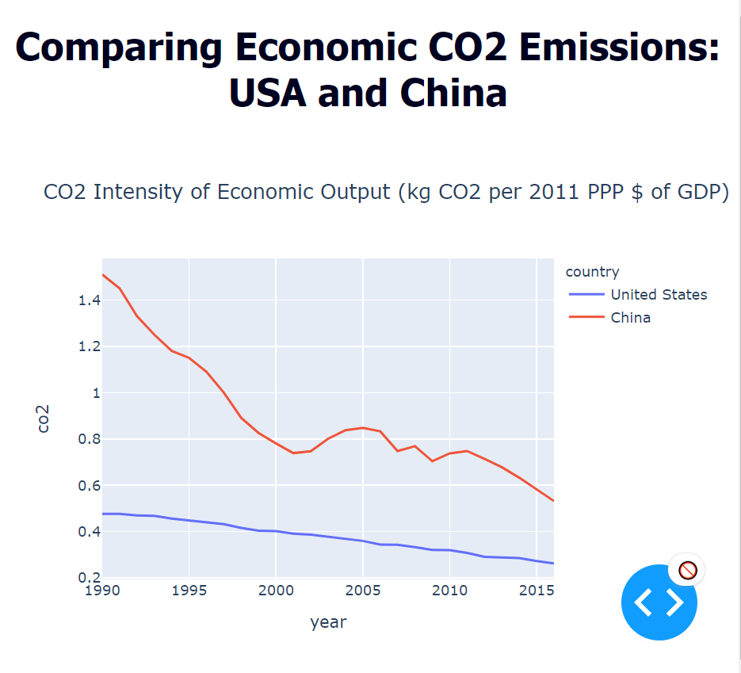

# CO2EmissionsEconomic
Plotly graph comparing USA and China CO2 economic emissions. Used to help me write a research paper.

One of the many factors of GDP is a country's CO2 emissions as a result of economic output. Since I have an interest in the environment and sustainability, this category is particularly intriguing to me.

While writing a research paper on the changing GDP of the USA and China, I decided to create a graph of their economic CO2 emissions.

I used plotly, pandas, and dash with python to create a simple webapp displaying this data. The data is from www.gapminder.org/data/, a Swedish organization that collects reliable statistics.

The results were as follows:

Note: When deployed or run from you rlocal machine, the graph is interactive; you can hover over a point for specific data.

